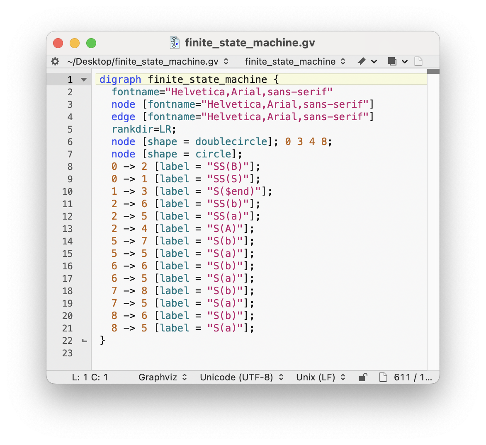

# Graphviz Codeless Language Module
BBEdit codeless language module for Graphviz documents.

## Features
- Syntax highlighting
- Code completion for keywords and identifiers, including attribute names, colors, shapes, styles, etc.
- Documentation for symbols can be accessed using `Search > Find in Documentation…`
- Commenting/uncommenting using `Cmd-/`

## Installation
Copy to BBEdit's Language Modules folder. 

If you select `BBEdit > Folders > Language Modules` in the BBEdit menu bar, the folder will be opened for you in the Finder.
