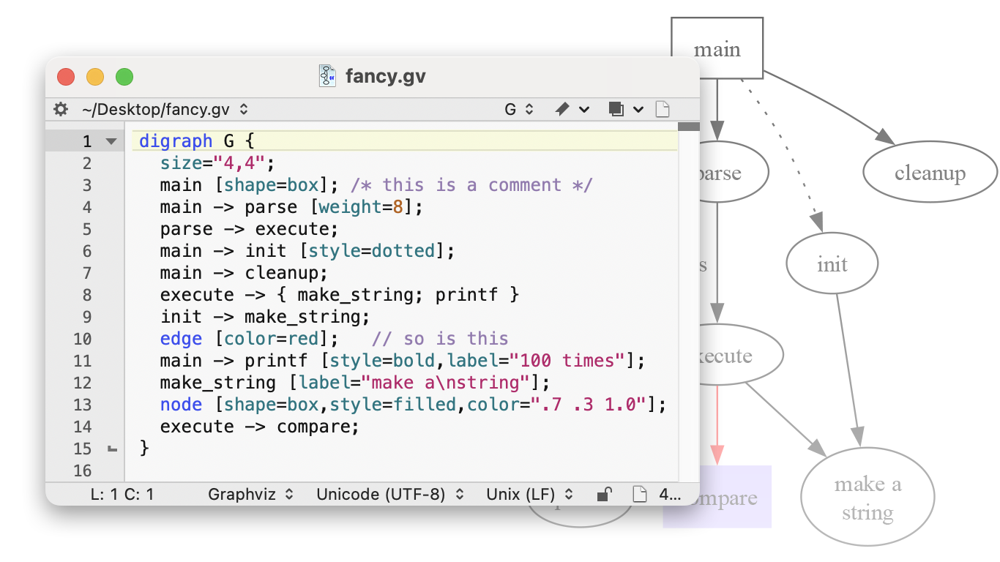

# Graphviz Codeless Language Module
Graphviz codeless language module for [BBEdit](https://www.barebones.com/products/bbedit/index.html).

## Features
- Syntax highlighting
- Code completion for keywords and identifiers - includes attributes, colors, shapes, styles and more
- Documentation for many symbols can be accessed using `Search > Find in Documentation…`
- Commenting/uncommenting using `Cmd-/`

## Installation
Copy `Graphviz.plist` to the Language Modules folder in `~/Library/Application Support/BBEdit/`. 

If you select `BBEdit > Folders > Language Modules` in BBEdit, the folder will be opened for you in the Finder.
